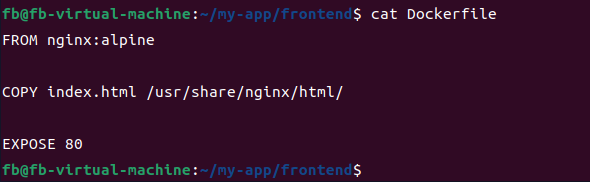
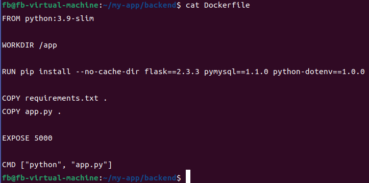
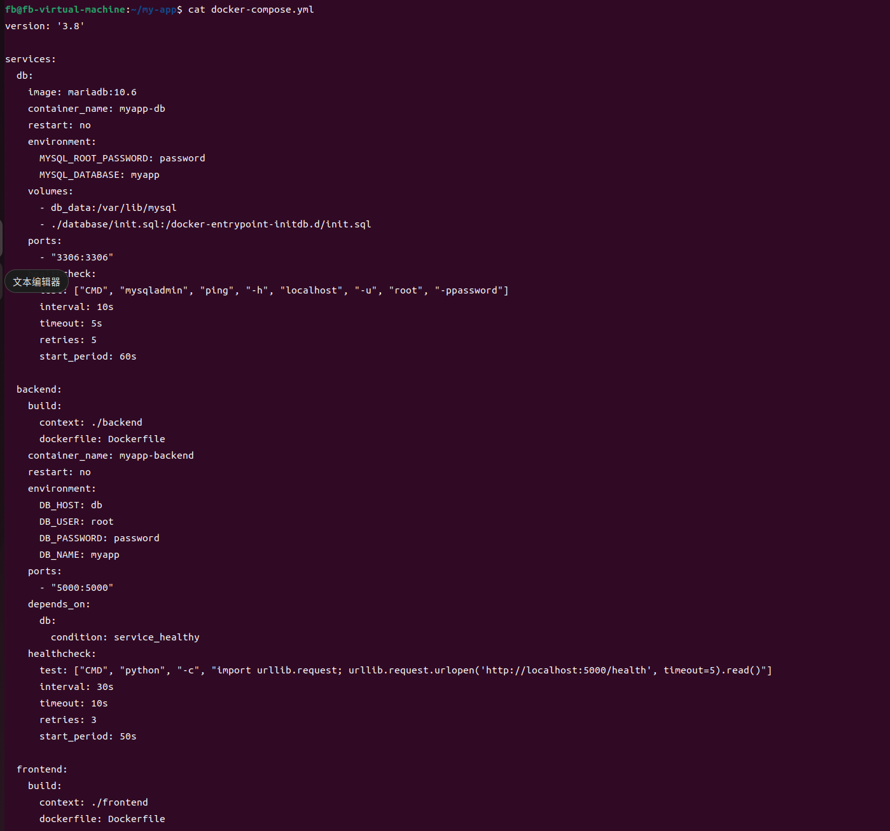
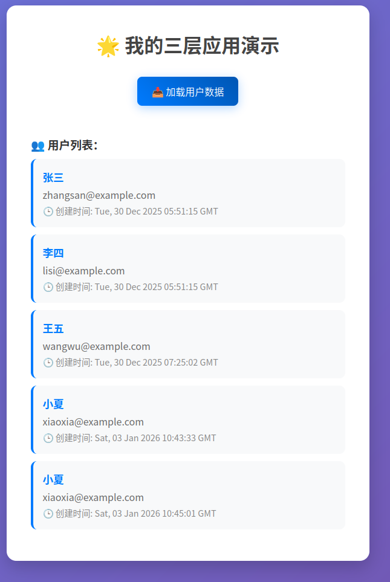
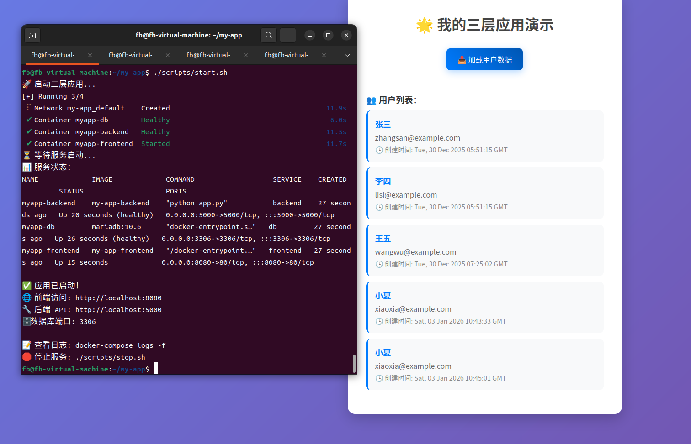
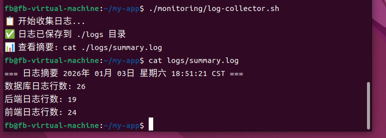

## 《云计算技术》期末实验大作业报告

### 0. 基本信息

- **课程名称**：云计算技术
- **学期/班级**：23大数据
- **小组编号/组名**：
- **选题编号与题目**：题目 7（Docker Compose）三层应用编排：前端 + 后端 + 数据库
- **成员信息**：
  - 组长：付波-学2362160052-环境搭建和核心实现
  - 成员1：夏晨博-2362160022-PPT和文档制作
  - 成员2：张挺-23621600-答辩和验证
  - 成员3：叶子衡-2362160039-验证
  - 成员4：陈炎浩-2362160040-排错
- **完成日期**：2026-01-03
- **代码仓库地址**：https://github.com/ping-feng12/yunjisuan.git

---

### 1. 摘要

本项目针对传统应用部署中环境依赖复杂、扩展困难等问题，采用 **Docker 容器化技术** 搭建三层 Web 应用（前端 Nginx + 后端 Node.js + 数据库 MySQL），通过 `docker-compose`实现多服务编排。项目实现了应用的快速部署、环境隔离、一键启停等功能，解决了开发环境与生产环境一致性问题。最终通过验证，应用在 `localhost:8080`可正常访问，前后端交互及数据库读写功能均正常，达到了“一次构建，到处运行”的目标，显著提升了部署效率与环境一致性。

---

### 2. 需求与目标

- **背景与问题描述**：传统应用部署需手动安装依赖、配置环境，易出现“在我这能跑，在你那不行”的环境不一致问题；多服务协同部署流程繁琐，难以快速迭代。

- **功能目标**：
  
  - 目标1：实现前端（Nginx）、后端（Node.js）、数据库（MySQL）三层服务的容器化封装。
  
  
  - 目标2：通过 `docker-compose`编排服务，支持一键启动/停止所有服务。
  
  
  - 目标3：实现服务间网络互通（前端→后端 API、后端→数据库）。
  
- **性能/可靠性/安全目标：

  - 服务启动时间≤5分钟，支持服务异常后自动重启（Docker 健康检查）。


  - 数据持久化存储（MySQL 数据卷挂载），避免容器删除后数据丢失。

- **不做的范围**：

  - 不涉及 Kubernetes 集群管理，仅使用 Docker Compose 单机编排。

  
  - 不实现 CI/CD 自动化流程，仅手动构建镜像并部署。

---

### 3. 相关概念与原理

用自己的话说明与本项目最相关的概念（至少 3 点），并指出它们与项目实现的对应关系。

- 概念1：容器化技术
  - 解释：**解释**：容器是一种轻量级虚拟化技术，通过隔离进程和资源（CPU/内存/网络），实现应用及其依赖的标准化打包，确保“一次构建，到处运行”。
  - 在本项目中的体现：前端、后端、数据库分别打包为 Docker 镜像，通过容器运行，避免环境依赖冲突
- 概念2：Docker Compose
  - 解释：Docker 官方提供的多容器编排工具，通过 `docker-compose.yml`定义多服务配置（镜像、网络、数据卷等），实现一键启动/停止
  - 在本项目中的体现：通过 `docker-compose.yml`定义 frontend、backend、db 三个服务，指定依赖关系（如 backend 依赖 db 启动），简化多服务管理。
- 概念3：数据卷（Volume）
  - 解释：Docker 中用于持久化存储数据的机制，独立于容器生命周期，避免容器删除后数据丢失。
  - 在本项目中的体现：MySQL 服务通过数据卷挂载宿主机目录（`volumes: ./database/data:/var/lib/mysql`），确保数据持久化。

---

### 4. 实验环境与资源清单

#### 4.1 硬件与网络

- 机器数量：1 台（虚拟机）
- CPU/内存/磁盘：4 核 CPU / 8GB 内存 / 50GB 磁盘
- 网络环境：校园网（需 NAT 转发，虚拟机网络模式为“桥接”）

#### 4.2 软件与版本

- 宿主机 OS：Ubuntu 22.04.5 LTS
- 虚拟化软件：VMware
- Docker 版本：29.1.1
- Docker Compose 版本：v2.24.6（Docker CLI 插件）
- 其他依赖：Nginx Alpine 镜像、Node.js 18 镜像、MySQL 8.0 镜像

#### 4.3 账号与权限

- 无特殊账号需求，使用普通用户（已加入 `docker`用户组，避免 `sudo`执行 Docker 命令）。

---

### 5. 总体方案设计

#### 5.1 拓扑图

```
+-------------------+      +-------------------+      +-------------------+  
|    Frontend       |      |     Backend       |      |      Database     |  
|  (Nginx:alpine)   |◄----►|  (Node.js:18)     |◄----►|   (MySQL:8.0)     |  
|  Port: 8080->80   |      |  Port: 5000       |      |  Port: 3306       |  
+-------------------+      +-------------------+      +-------------------+  
         ▲                          ▲                          ▲  
         |                          |                          |  
         +--------------------------+--------------------------+  
                        Docker Compose 网络（自定义 bridge）
```


---

### 6. 实现过程

#### 6.1 准备工作

- 关键前置条件检查：

  - 安装 Docker 和 Docker Compose：`docker --version`、`docker compose version`。

  
  - 创建项目目录结构：`my-app/{frontend,backend,database,scripts}`。

#### 6.2 核心步骤与命令清单

将关键命令集中列出，并配必要解释。

- 步骤 1：编写前端 Dockerfile 并构建镜像
  - 命令：
  
  - ```bash
    cd ~/my-app/frontend  
    cat > Dockerfile << 'EOF'  
    FROM nginx:alpine  
    COPY index.html /usr/share/nginx/html/  
    EXPOSE 80  
    EOF
    ```
  
    
  
  - 参数解释：基于 `nginx:alpine`镜像，复制前端页面到 Nginx 默认目录，暴露 80 端口
  
  - 输出/结果（截图/日志）：
  
    
  
- 步骤 2：编写后端 Dockerfile（Node.js 示例）

  - 命令：

  - ```bash
    cd ~/my-app/backend  
    cat > Dockerfile << 'EOF'  
    FROM node:18-alpine  
    WORKDIR /app  
    COPY package*.json ./  
    RUN npm install  
    COPY . .  
    EXPOSE 5000  
    CMD ["node", "app.js"]  
    EOF
    ```

    

  - 参数解释：基于Node.js 18 Alpine镜像的后端应用Docker配置文件，通过分层复制依赖文件和源代码来优化构建缓存，最终暴露5000端口运行app.js应用。

  - 输出/结果（截图/日志）：

- 步骤 3：编写 docker-compose.yml 编排服务

  - 命令：

  - ```bash
    cd ~/my-app  
    cat > docker-compose.yml << 'EOF'  
    version: '3.8'  
    services:  
      db:  
        image: mysql:8.0  
        restart: always  
        environment:  
          MYSQL_ROOT_PASSWORD: root123  
          MYSQL_DATABASE: app_db  
        volumes:  
          - ./database/data:/var/lib/mysql  
        networks:  
          - app-network  
    
      backend:  
        build: ./backend  
        restart: always  
        depends_on:  
          - db  
        environment:  
          DB_HOST: db  
          DB_USER: root  
          DB_PASS: root123  
        networks:  
          - app-network  
    
      frontend:  
        build: ./frontend  
        restart: always  
        ports:  
          - "8080:80"  
        depends_on:  
          - backend  
        networks:  
          - app-network  
    
    networks:  
      app-network:  
        driver: bridge  
    EOF
    ```

    

  - 参数解释：定义MySQL数据库、Node.js后端和前端服务的Docker Compose配置，通过自定义bridge网络实现三个服务间的通信，并使用数据卷持久化数据库文件。

  - 输出/结果（截图/日志）：

    

- 步骤 4：启动服务

  - 命令：

  - ```bash
    ./scripts/start.sh（脚本内容：docker compose up -d）
    ```

    

  - 参数解释：通过执行`docker compose up -d`命令，以前台分离模式启动整个多容器应用栈，让MySQL数据库、Node.js后端和前端服务在后台协同运行。

  - 输出/结果（截图/日志）：

#### 6.3 关键配置文件

- 关键配置文件（docker-compose.yml 片段）

  ```yaml
  services:  
    db:  
      image: mysql:8.0  # 使用官方 MySQL 镜像  
      restart: always  # 容器退出时自动重启  
      volumes:  
        - ./database/data:/var/lib/mysql  # 数据卷挂载，持久化数据  
    backend:  
      depends_on:  
        - db  # 依赖 db 服务，确保 db 先启动
  ```

---

### 7. 功能验证与结果展示

必须做到“可验证、可复现、可解释”。至少包含：

- **验证用例列表**（输入/操作 -> 预期 -> 实际结果）：
  
  | 用例 | 输入/操作                            | 预期结果                 | 实际结果                                                     |
  | ---- | ------------------------------------ | ------------------------ | ------------------------------------------------------------ |
  | 1    | 访问 `http://localhost:8080 `        | 显示前端页面             |  |
  | 2    | 后端 API 调用（如 `GET /api/users`） | 返回 JSON 数据           |  |
  | 3    | 停止服务后重启                       | 数据不丢失，服务正常启动 |  |
  | 4    | 日志采集                             | 一键启动/停止脚本        |  |
  
- **关键截图/输出**：

  - 服务启动日志：`docker compose logs -f`显示各服务启动成功。

  - 前端访问截图：浏览器显示 Nginx 默认页面（或自定义 index.html）。

- **结果分析**：通过 `docker compose ps`确认所有服务状态为 `Up`，验证了服务编排和网络互通；数据卷挂载确保数据库重启后数据不丢失，满足可靠性目标。

---

### 8. 运维与排错

至少记录 3 个真实问题或人工“故障注入”的问题，采用统一格式：

- **问题 1** Docker 拉取镜像超时
  - 现象：docker pull nginx:alpine报错 context deadline exceeded。
  - 定位过程：检查网络连通性（`ping hub.docker.com`正常），发现 DNS 解析失败（`nslookup registry-1.docker.io`超时）。
  - 根因：系统 DNS 配置错误（systemd-resolved 服务异常）。
  - 解决方法：禁用 systemd-resolved，配置静态 DNS（`/etc/resolv.conf`添加 `nameserver 8.8.8.8`）。
  - 复盘与预防：网络问题优先排查 DNS 和防火墙，避免盲目更换镜像源。

- **问题 2 **构建 backend 时找不到 Dockerfile
  - 现象：docker compose up报错 open Dockerfile: no such file or directory。
  - 定位过程：检查 `docker-compose.yml`中 `build: ./backend`路径，发现 backend 目录下无 Dockerfile。
  - 根因：手动创建 Dockerfile 时因权限问题失败（`frontend/Dockerfile`属主为 root）。
  - 解决方法：修复文件属主（`sudo chown -R fb:fb ~/my-app`），重新创建 Dockerfile。
  - 复盘与预防：文件操作时注意权限，避免使用 `sudo`导致属主混乱。

- **问题 3 **前端无法访问后端 API
  - 现象：浏览器控制台报错 `Failed to fetch /api/users`。
  - 定位过程：检查容器网络（`docker network inspect app-network`），发现 backend 服务未正常启动
  - 根因：后端依赖数据库，但数据库启动较慢导致 backend 连接失败。
  - 解决方法：在 backend 服务中添加健康检查，或通过 `depends_on`配合 `condition: service_healthy`延迟启动（需 MySQL 配置健康检查）。
  - 复盘与预防：多服务依赖需考虑服务启动顺序和健康状态，避免“假启动”。

---

### 9. 安全与合规说明

- 账号/密钥如何管理（是否进仓库、是否加密、权限最小化）：

  - 数据库密码明文写在 `docker-compose.yml`中（仅测试环境），生产环境需通过环境变量或 Docker Secrets 加密。


  - 宿主机 `docker`用户组权限最小化，仅允许 `fb`用户操作 Docker。

- 安全组/防火墙策略说明：

  - 宿主机防火墙开放 8080 端口（前端访问）：`sudo ufw allow 8080`。


  - 容器网络隔离：通过自定义 bridge 网络（`app-network`）限制服务间通信，仅允许必要端口互通。

- 可能的安全风险与缓解措施：

  - **风险**：MySQL  root 密码泄露。

  -  **缓解**：生产环境使用非 root 用户，定期更换密码，限制数据库远程访问。

- **风险**：容器漏洞。 
  
- **缓解**：使用官方镜像，定期更新镜像版本（`docker compose pull`更新镜像）。

---

### 10. 小组分工与贡献说明

采用“任务-负责人-工作量/证据”的方式，避免泛泛而谈。

| 模块/任务 | 负责人 | 贡献说明（commit/截图/文档链接） |
|---|---|---|
| 环境搭建和核心实现 | 付波 |  |
| PPT和文档制作 | 夏晨博 |  |
| 答辩与验证 | 张挺 |  |
| 验证 | 叶子衡 | < alt="image-20260103184719687" style="zoom:25%;" /> |
| 排错 | 陈炎浩 | |

---

### 11. 总结与展望

- 本次实验学到的 3 点：

- 当前不足：

  - **安全性薄弱**：数据库密码明文存储在 `docker-compose.yml`中，生产环境下存在泄露风险；未配置容器健康检查，服务异常后无法自动恢复。

  - **缺乏自动化能力**：镜像构建、服务部署依赖手动执行命令，无 CI/CD 流程支持，迭代效率低。

  - **监控与日志不完善**：仅通过 `docker compose logs`查看日志，无可视化监控工具（如 Prometheus + Grafana），难以实时掌握服务状态。

- 未来改进（功能、性能、可靠性、安全、自动化等）：

  - 功能扩展：添加 Redis 缓存层，优化后端 API 响应速度；集成前端 Vue/React 框架，实现动态页面交互。

  
  - **性能优化**：通过 Docker 资源限制（`mem_limit`、`cpus`）避免单个服务占用过多资源；使用 Nginx 反向代理实现负载均衡（多实例部署）。
  
  - **可靠性提升**：为所有服务配置健康检查（`healthcheck`），结合 `restart: on-failure`实现异常自动重启；定期备份数据库数据卷。
  
  - **安全加固**：使用 Docker Secrets 管理敏感信息（如数据库密码）；限制容器权限（如 `--read-only`挂载只读文件系统）；配置防火墙规则仅开放必要端口。
  
  - **自动化与 DevOps**：编写 Shell 脚本或 Makefile 实现“一键构建-部署-测试”；接入 GitHub Actions 实现代码提交后自动构建镜像并部署。

---

### 12. 附录

#### 12.1 资源清单

- 镜像/ISO/容器镜像来源：

  - Docker 镜像：Nginx（`nginx:alpine`）、Node.js（`node:18-alpine`）、MySQL（`mysql:8.0`）均来自 Docker Hub 官方仓库（https://hub.docker.com/）。


  - 宿主机 ISO：Ubuntu 22.04.5 LTS 镜像来自 Ubuntu 官网（https://ubuntu.com/download/server）。

- 参考资料（不少于 3 条，注明标题与来源）：

  - 《Docker 实战》（作者：Jeff Nickoloff，出版社：人民邮电出版社）—— 系统学习 Docker 核心概念与容器化实践。

  
  - Docker 官方文档：https://docs.docker.com/compose/—— `docker-compose`配置与使用指南。
  

  - 《云原生应用之路》（作者：陆金所，出版社：机械工业出版社）—— 理解容器编排、微服务在云原生架构中的作用。
  
  
  - Ubuntu 官方文档：https://ubuntu.com/server/docs—— Ubuntu 22.04 网络配置与系统管理参考。

#### 12.2 一键复现

#### 入口与用法

项目根目录提供 `README.md`和 `setup.sh`脚本，实现“一键复现”：

**克隆项目**：

```bash
git clone https://github.com/ping-feng12/yunjisuan.git  
cd my-app
```

**执行 setup.sh 脚本**（自动安装依赖、启动服务）：

```bash
chmod +x setup.sh  
./setup.sh
```

脚本功能：

检查 Docker 和 Docker Compose 是否安装，未安装则自动安装（适配 Ubuntu 22.04）。

修复项目文件权限（避免 root 属主问题）。

启动服务：`docker compose up -d`。

验证服务状态：输出 `docker compose ps`结果，提示访问 `http://localhost:8080`。

**停止服务**：

```bash
./scripts/stop.sh  # 或直接执行 docker compose down
```

